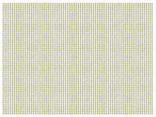

# BinaryBadApple v1.0

Bad Apple but rendered with only 0s and 1s

Can be used to convert a video into 0s and 1s (and more)

# Demo

# Libraries Utilized

- OpenCV
- ffmpeg-python
- Pillow

# Usage

Major configurations are stored in `config.py`

Please ensure that you have `ffmpeg` and all relevant libraries installed before running this project

## Steps to using

1. Modify `config.py` with the filename, font, and font size you want
2. In `main.py`, uncomment / comment out the portions that you need
3. Execute `main.py`
4. Retrieve the file from `final.mp4`

## Configurations

Under `config.py`, there are multiple attributes that we can adjust. 

- FILENAME: Specifies the file path of the video, please place the video in the same directory for convenience
- FONT: Specifies the font used to generate the video
- FONT_SIZE: Specifies the resolution of the **FINAL OUTPUT VIDEO**
- RESOLUTION_FRACTION: Specifies the resolution generated by the 0s and 1s, the higher this number, the lesser 0s and 1s on the screen
- CHARS: The characters used to map the light and dark

# File Directory Structure

- `Arial.ttf`: The font used by default
- `config.py`: Stores the configurations for this project
- `final.mp4`: The final video output
- `finalNoAudio.mp4`: The final video output without the song yet
- `main.py`: The entry point to the application
- `original.mp4`: The original Bad Apple video downloaded from [here](https://archive.org/details/TouhouBadApple)
- `originalAudio.mp3`: The audio file I have extracted from the original Bad Apple video
